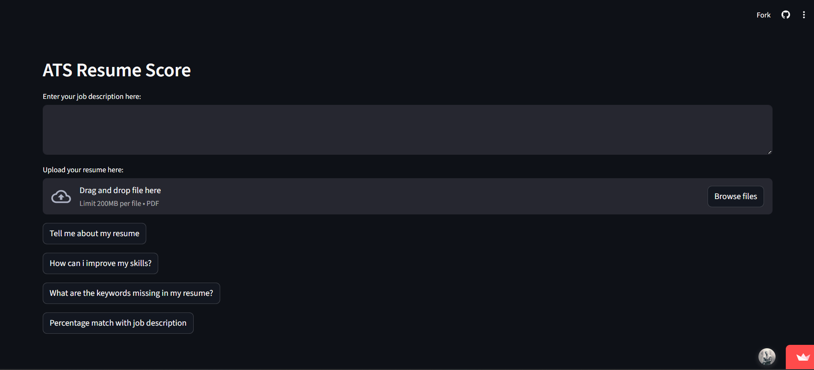

# 📄 ATS Resume Score


<p align="justify">
<strong>ATS Resume Score</strong> is a powerful Streamlit-based web application that leverages Google's <strong>Gemini AI</strong> to analyze resumes against job descriptions. It simulates an intelligent Applicant Tracking System (ATS) scorer, providing actionable insights to help candidates improve their profiles.
</p>

---

## 🚀 Live Demo

Try the live version of the app:

<a href="https://ats-resume-score-945.streamlit.app/">
  
</a>

---

## 🖼️ App Preview

<p align="left">
  
  
  
  
  
</p>

<p align="center">
  
</p>


---

## ✨ Features

- **📊 Resume Analysis**: Upload a PDF resume and get a detailed evaluation of alignment with the job description.
- **💡 Skill Improvement**: Receive personalized advice on how to enhance your skills.
- **🔑 Keyword Analysis**: Identify missing keywords and get a percentage match score.
- **📈 Percentage Match**: Understand how well your resume fits the job requirements.
- **🧮 ATS Score Output**: Generates a numerical ATS match score (0–100) with clear interpretation.


---

## 🛠️ How It Works

1.  **Input**: Enter the job description and upload your resume (PDF).
2.  **Processing**: The app converts the PDF to an image and prepares it for analysis.
3.  **AI Analysis**: Google's **Gemini 2.5 Flash** model analyzes the content.
4.  **Results**: View detailed feedback, strengths, weaknesses, and missing keywords.

---

## 🧪 Example Use Case

**Job Role**: Data Analyst  
**Resume Match Score**: 72%  

**Missing Keywords**:
- SQL Optimization
- Power BI DAX
- Statistical Modeling

**AI Suggestions**:
- Add measurable achievements using metrics
- Include project-based experience aligned with job description

---

## 📋 Requirements

-   Python 3.7+
-   Google API Key (for Gemini AI)
-   Virtual environment (recommended)

---

## ⚙️ Installation

1.  **Clone the repository**:
    ```bash
    git clone <repository-url>
    ```

2.  **Create a virtual environment**:
    ```bash
    python -m venv venv
    ```

3.  **Activate the virtual environment**:
    -   **Windows**: `venv\Scripts\activate`
    -   **macOS/Linux**: `source venv/bin/activate`

4.  **Install dependencies**:
    ```bash
    pip install -r requirements.txt
    ```

5.  **Set up environment variables**:
    -   Create a `.env` file in the project root.
    -   Add your Google API Key:
        ```env
        GOOGLE_API_KEY=your_api_key_here
        ```

---

## ▶️ Running the Application

1.  Ensure your virtual environment is activated.
2.  Run the Streamlit app:
    ```bash
    streamlit run app.py
    ```
3.  Open your browser and navigate to `http://localhost:8501`.

---

## 🔒 Security

This application is designed with security in mind:
-   **No Hardcoded Secrets**: API keys are managed via environment variables (`.env`).
-   **Local Processing**: Files are processed in memory and sent directly to the Gemini API.

---

## 📦 Dependencies

-   `streamlit`: Web interface
-   `google-generativeai`: AI analysis
-   `python-dotenv`: Environment management
-   `pdf2image`: PDF processing
-   `Pillow`: Image manipulation

---

## 📝 Notes

-   The application currently processes the **first page** of the uploaded PDF.
-   Ensure your Google API Key has access to the **Gemini API**.

---

## 📄 License

This project is licensed under the MIT License.

